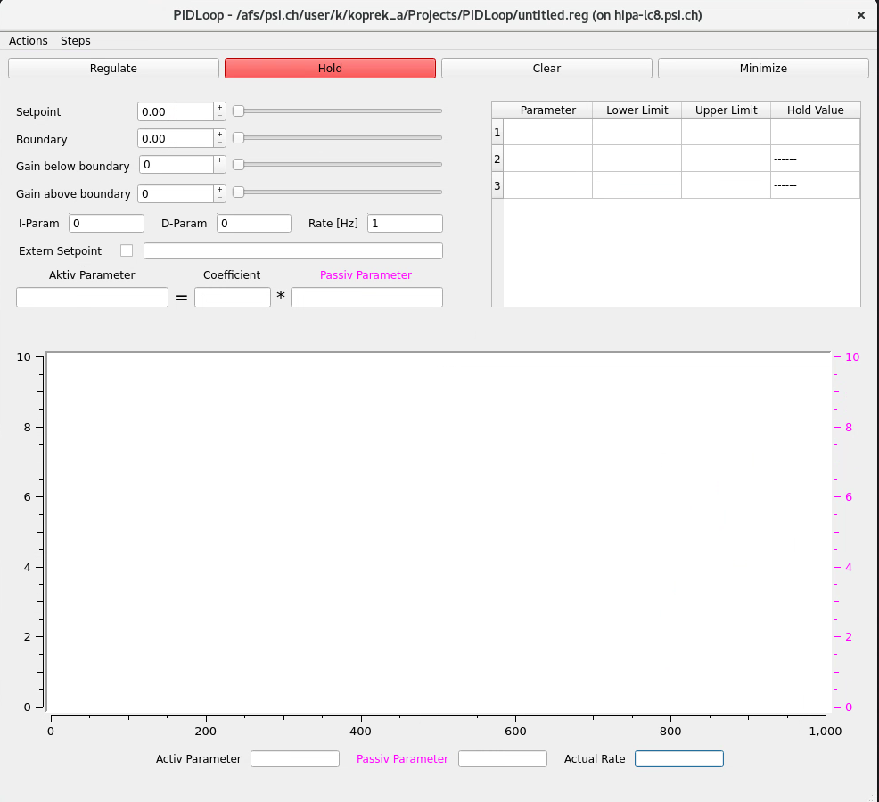

<a name="readme-top"></a>

<br />
<div align="center">
  <a href="https://git.psi.ch/hipa_apps/pidloop">
    
  </a>

<h3 align="center">PIDLoop</h3>

<p align="center">
    A generic application to create a PIDLoop with configuration files for HIPA
    <br />
    <a href="https://git.psi.ch/koprek_a/pidloop/-/issues/new">Report Bug</a>
    ·
    <a href="https://acceleratorwiki.psi.ch/wiki/PID_Loop">Accelerator Wiki</a>
    .
    <a href="https://git.psi.ch/koprek_a/pidloop/-/wikis/PID-from-Mezger-(pidControl)">GitLab Wiki</a>
  </p>
</div>

## About The Project

<p align="center">
  
</p>

This is an app that takes tow EPICS PV's one for the passive the other for the active parameter. Then the user
has to enter the parameters for the PID Control and it tries to get to the desired settings. Configuration can
be saved and read from files. The full documentation and user manul can be found on the [Accelerator Wiki](https://git.psi.ch/koprek_a/pidloop/-/wikis/PID-from-Mezger-(pidControl)).

### Built With

[](#)
[](#)
[](#)
[](#)
[](#)

## Getting Started

If you want to compile your own copy of the project just follow these steps:

Clone the project

```bash
git clone https://git.psi.ch/hipa_apps/pidloop
```

Create a workspace

```bash
cd pidloop
mkdir cmake
cd cmake
```

Prepare the environment

```bash
cmake .. -DCMAKE_BUILD_TYPE=Release
```

Build the project

```
make
```

Run the app

```bash
../bin/<Your Procesor Architecture>/Release/pidloop
```

### Prerequisites

Tested on RHEL8 - hipalc

- CMake 3.16
- GCC 17
- Qt5
- Qwt
- Eipcs Libraries
- [Cafe](https://git.psi.ch/cafe)

## Contributing

Contributions are what make the open source community such an amazing place to learn, inspire, and create. Any contributions you make are **greatly appreciated**.

If you have a suggestion that would make this better, please fork the repo and create a pull request. You can also simply open an issue with the tag "enhancement".
Don't forget to give the project a star! Thanks again!

1. Clone the project
2. Create your Feature Branch (`git checkout -b feature/AmazingFeature`)
3. Commit your Changes (`git commit -m 'Add some AmazingFeature'`)
4. Push to the Branch (`git push origin feature/AmazingFeature`)
5. Open a Pull Request

## Contact

The author is: [Adam Korpek](https://github.com/adkoprek) - adam.koprek@stud.kswe.ch
The maintainer is: [Jochem Snuverink](https://www.psi.ch/de/people/jochem-snuverink) - jochem.snuverink@psi.ch
